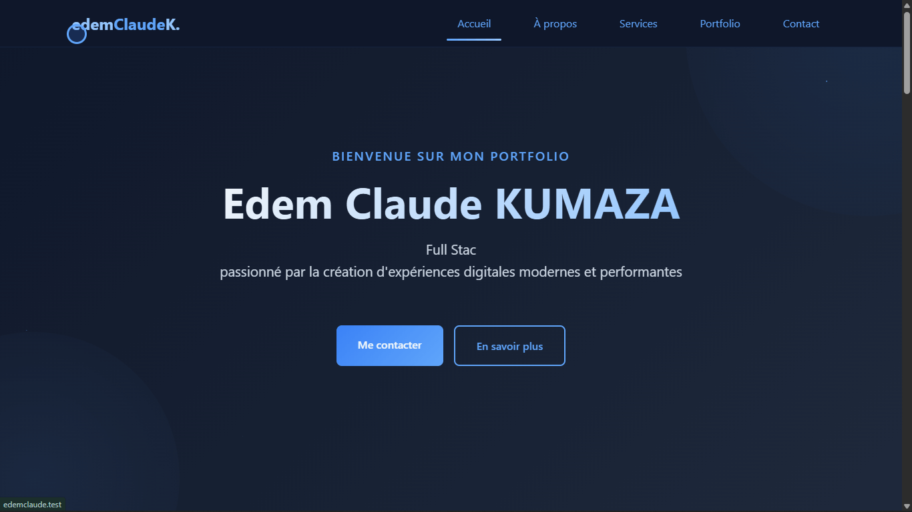
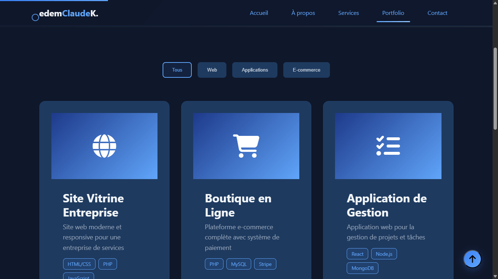
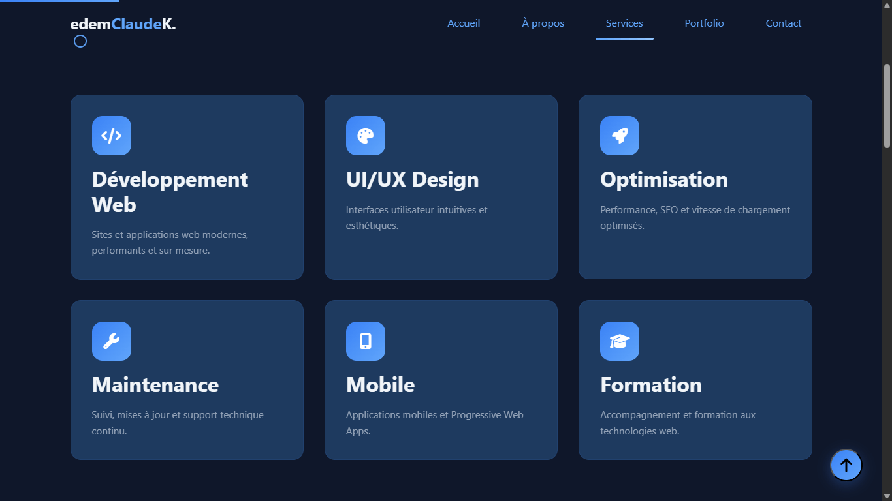
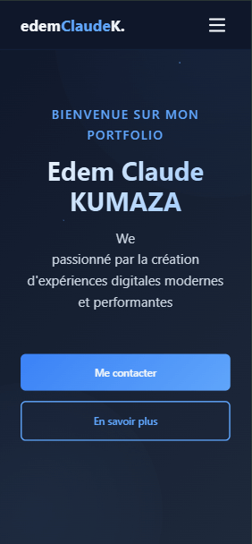
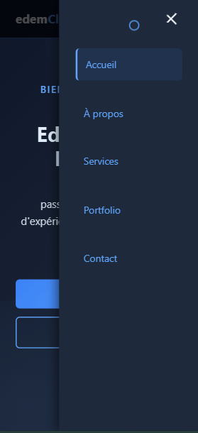
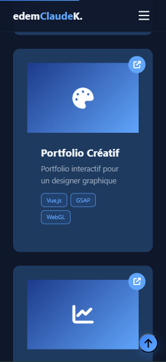

# 🚀 Portfolio - Edem Claude KUMAZA

[](https://www.php.net/)
[](https://phpunit.de/)
[](LICENSE)
[](http://makeapullrequest.com)

> Portfolio personnel moderne développé en PHP avec architecture MVC, tests unitaires et design responsive.

**🌐 [Démo Live](https://edemclaude.github.io/claudefolio/)** • **📧 [Contact](mailto:edemclaudek@gmail.com)** • **💼 [LinkedIn](https://linkedin.com)**

---

## 📸 Aperçu

### Page d'accueil


### Portfolio & Services
<p float="left">
  
  
</p>

### Responsive Design
<p float="left">
  
  
  
</p>

---

## ✨ Fonctionnalités

### 🏗️ Architecture
- ✅ **MVC personnalisé** - Architecture propre et maintenable
- ✅ **Routeur HTTP** - Gestion GET/POST avec dispatch automatique
- ✅ **Asset Manager** - Chargement dynamique avec cache busting
- ✅ **Environment Config** - Gestion des variables .env

### 🎨 Design & UX
- ✅ **Thème moderne** - Dark mode avec accents bleus
- ✅ **100% Responsive** - Mobile, tablette, desktop
- ✅ **Animations fluides** - Scroll reveal, typing effect, particules
- ✅ **Menu hamburger** - Navigation mobile intuitive
- ✅ **Font Awesome** - Icônes vectorielles professionnelles

### 🧪 Qualité du Code
- ✅ **27 tests PHPUnit** - Couverture unitaire et fonctionnelle
- ✅ **PHPDoc complet** - Documentation sur toutes les classes
- ✅ **PSR-4 Autoloading** - Standards PHP respectés
- ✅ **CI/CD GitHub Actions** - Tests automatiques à chaque push

---

## Structure

```
edemclaude/
├── public/           # Point d'entrée web (Document Root)
│   ├── index.php    # Front controller
│   ├── .htaccess    # Réécriture d'URL
│   └── assets/      # Ressources statiques (CSS, JS, images)
│       ├── css/
│       ├── js/
│       └── img/
├── src/             # Code source
│   ├── Controllers/ # Contrôleurs
│   ├── Core/        # Classes système (Env, Asset, etc.)
│   └── Http/        # Routeur HTTP
├── templates/       # Templates PHP
├── config/          # Configuration
│   └── app.php
└── .env.example     # Variables d'environnement (exemple)
```

## Installation

1. **Copier `.env.example` vers `.env`**
   ```bash
   copy .env.example .env
   ```

2. **Configurer le virtual host** pour pointer vers `public/`

3. **Accéder au site**
   - URL: `http://localhost` ou `http://edemclaude.test`

## Développement

- **Routeur**: `src/Http/Router.php`
- **Contrôleurs**: `src/Controllers/`
- **Templates**: `templates/`
- **Assets**: `public/assets/css/`, `public/assets/js/`, `public/assets/img/`
- **Helper Asset**: `src/Core/Asset.php` - Gestion dynamique des assets

## Routes

- `GET /` → Page d'accueil (HomeController::index)
- `GET /about` → À propos (AboutController::index)
- `GET /services` → Services (ServicesController::index)
- `GET /portfolio` → Portfolio (PortfolioController::index)
- `GET /contact` → Formulaire contact (ContactController::index)
- `POST /contact/submit` → Soumission formulaire (ContactController::submit)

## Fonctionnalités

### Architecture
- ✅ Routeur HTTP personnalisé (GET/POST)
- ✅ Architecture MVC propre
- ✅ Chargement dynamique des assets avec versioning
- ✅ Composants réutilisables (header)
- ✅ Gestion des variables d'environnement (.env)

### Design & UI
- ✅ Thème sombre moderne (bleu foncé)
- ✅ Menu hamburger responsive (mobile)
- ✅ Navigation avec highlight du lien actif
- ✅ Design moderne et professionnel
- ✅ Responsive sur tous écrans

### Pages
- ✅ **Accueil** - Hero, À propos, Compétences, Contact rapide
- ✅ **À propos** - Parcours, valeurs, timeline, statistiques
- ✅ **Services** - 6 services détaillés avec CTA
- ✅ **Portfolio** - Grille de projets avec filtres par catégorie
- ✅ **Contact** - Formulaire fonctionnel avec validation

### Animations & Interactions
- ✅ Loader de page
- ✅ Typing effect sur le hero
- ✅ Particules flottantes
- ✅ Barres de progression animées (compétences)
- ✅ Curseur personnalisé
- ✅ Scroll progressif
- ✅ Révélation au scroll
- ✅ Hover effects (wave, shine)
- ✅ Filtres portfolio interactifs

### Formulaire Contact
- ✅ Validation temps réel
- ✅ Soumission AJAX
- ✅ Messages succès/erreur
- ✅ Design moderne

## Tests

Le projet inclut une suite de tests unitaires et fonctionnels avec PHPUnit.

### Installation des dépendances de test

```bash
composer install
```

### Lancer les tests

```bash
# Tous les tests
composer test

# Ou directement avec PHPUnit
vendor/bin/phpunit
```

### Structure des tests

```
tests/
├── Unit/              # Tests unitaires
│   ├── Core/         # Tests des classes Core (Asset, Env)
│   └── Http/         # Tests du Router
└── Feature/          # Tests fonctionnels
    └── ControllersTest.php  # Tests des contrôleurs
```

### Tests disponibles

- ✅ **AssetTest** - Tests de génération CSS/JS avec versioning
- ✅ **EnvTest** - Tests de chargement des variables d'environnement
- ✅ **RouterTest** - Tests des routes GET/POST et dispatch
- ✅ **ControllersTest** - Tests fonctionnels de tous les contrôleurs


## Documentation

- 📄 **README.md** - Documentation principale
- 📄 **STRUCTURE.md** - Structure du projet et flux de requête
- 📄 **ANIMATIONS.md** - Documentation des animations
- 📄 **PAGES.md** - Guide de création de nouvelles pages
- 📄 **VHOST_SETUP.md** - Configuration du virtual host

## 🚀 Déploiement

### GitHub Pages (Démo Statique)

Le projet inclut une configuration GitHub Actions pour déploiement automatique:

```bash
# Les workflows sont déjà configurés dans .github/workflows/
# - tests.yml: Tests automatiques à chaque push
# - deploy.yml: Déploiement sur GitHub Pages
```

**Étapes:**
1. Allez dans **Settings** > **Pages** de votre repo
2. Source: Sélectionnez `GitHub Actions`
3. Push sur `main` déclenche automatiquement le déploiement

📖 **[Guide complet GitHub Pages](docs/GITHUB_PAGES.md)**

### Hébergement PHP

Pour la version PHP complète avec backend:
- **InfinityFree**: https://infinityfree.net/
- **000webhost**: https://www.000webhost.com/
- **Railway**: https://railway.app/

## 📸 Screenshots

Pour ajouter des captures d'écran au README:

1. Prenez des screenshots de votre portfolio
2. Placez-les dans `docs/screenshots/`
3. Optimisez-les (< 500KB)

📖 **[Guide Screenshots détaillé](docs/SCREENSHOTS.md)**

## 🤝 Contribution

Les contributions sont les bienvenues! Voici comment contribuer:

1. **Fork** le projet
2. Créez votre branche (`git checkout -b feature/AmazingFeature`)
3. Committez vos changements (`git commit -m 'Add: Amazing feature'`)
4. Push vers la branche (`git push origin feature/AmazingFeature`)
5. Ouvrez une **Pull Request**

### Commits conventionnels

Utilisez des messages de commit clairs:
```
feat: Ajouter nouvelle fonctionnalité
fix: Corriger un bug
docs: Mettre à jour la documentation
style: Améliorer le design
test: Ajouter des tests
refactor: Refactoriser le code
```

## 📄 License

Ce projet est sous license MIT - voir le fichier [LICENSE](LICENSE) pour plus de détails.

## 👨‍💻 Auteur

**Edem Claude KUMAZA**
- GitHub: [@edemClaude](https://github.com/edemClaude)
- Email: edemclaudek@gmail.com
- LinkedIn: [Votre LinkedIn](https://linkedin.com)

## 🙏 Remerciements

- [Font Awesome](https://fontawesome.com/) - Icônes
- [PHPUnit](https://phpunit.de/) - Tests
- [GitHub Actions](https://github.com/features/actions) - CI/CD

---

<p align="center">
  Fait avec ❤️ par Edem Claude KUMAZA
</p>

<p align="center">
  <a href="#-portfolio---edem-claude-kumaza">⬆️ Retour en haut</a>
</p>
